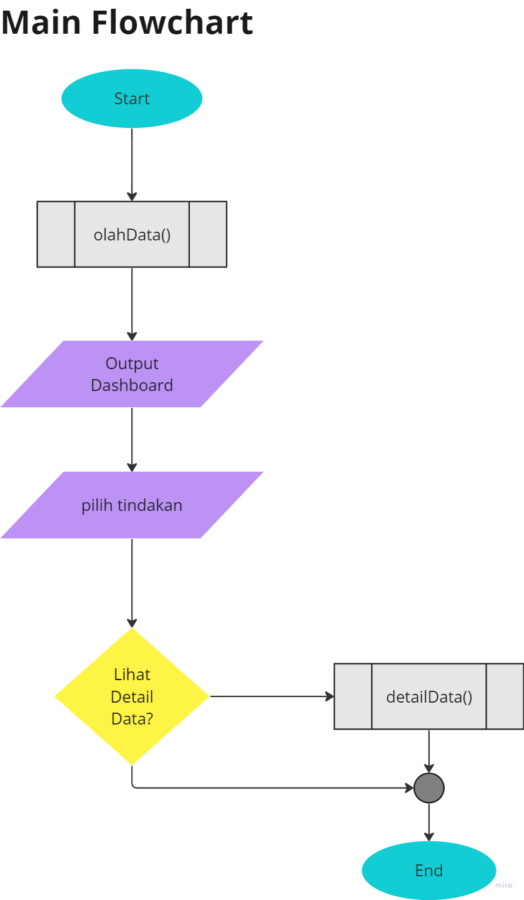

# MidTerm-Exam-Mobile-Programming
Repository untuk hasil program bahan Ujian Tengah Semester (UTS) Pemrograman Mobile Tahun Ajaran 2023-2024

# Dashboard Mobile - Project
Dashboard Data Hasil Kuisioner Mahasiswa sederhana menggunakan bahasa pemrograman dart dengan melibatkan framework Laravel sebagai backend dan Flutter sebagai framework pengembangan antarmuka pengguna (UI / User Interface).

# Tujuan Project
    1. Membuat Dashboard sederhana yang dapat menampilkan beberapa hasil data kuisioner terkait masalah komplain oleh mahasiswa. Dengan data yang ditampilkan sebagai berikut:
    a. Total pengisi survey (reposnden)
    b. Jumlah faktor yang dipermasalahkan (per faktor)
    c. Jumlah responden berdasarkan gender
    d. Jumlah responden berdasar negara asal
    e. Rata-rata umur responden total
    f. Rata-rata IPK (GPA) responden total
    g. Detil hasil survey per responden

    2.  Membuat program dengan bahasa pemrograman Dart, menggunakan Framework Laravel dan Flutter

    3. Mengaplikasikan pembuatan program yang berbasis fungsi (function) atau objek (OOP)

# Alur Sistem

# Deskripsi Task

# Cara Penggunaan

# Hasil Pengujian Program

# Dokumentasi Pengembangan
## 1. Designing User Interface

## 2. Coding Interface

## 3. Coding System

## 4. Group's Meeting

## 5. Testing System

# Contributor
    Kelompok 6 SIB 3E
    1. Niken Maharani Permata - 2141762006 / 19
        Peran : UI Designer dan Technical Writer
    2. Muhammad Al Kindy - 2141762057 / 14
        Peran : Backend and Frontend Developer
    3. Laita Zidan
        Peran : expected Frontend Developer

